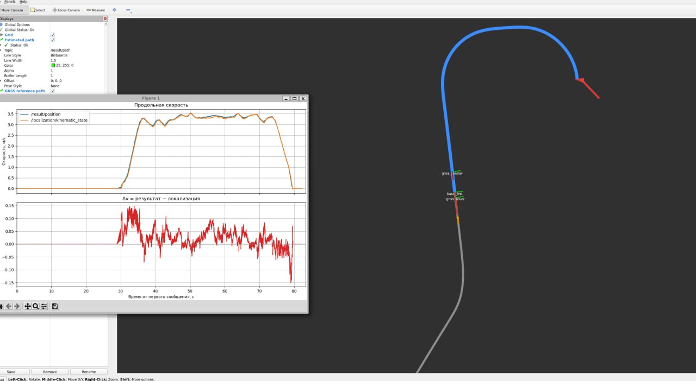

# Резервная одометрия трамвая



ROS 2 пакет `tram_model` оценивает скорость и положение трамвая по команде водителя и скоростям тележек. Динамическая модель учитывает тягу, торможение и сцепление; для оценки положения используются EKF и привязка к маршруту. GNSS нужен для начальной привязки к координатам и может использоваться для коррекции.

**Документация:** [axiom-tram.s3-website.cloud.ru](https://axiom-tram.s3-website.cloud.ru)

## Быстрый запуск

Нужны ROS 2 Humble и пакет сообщений `tram_vehicle_msgs` в том же `colcon` workspace. Разместите этот репозиторий в `<ros2_ws>/src/tram_model`, затем выполните из корня workspace:

```bash
source /opt/ros/humble/setup.bash
colcon build --packages-select tram_vehicle_msgs tram_model
source install/setup.bash
ros2 launch tram_model tram_model.launch.py position_source:=route velocity_source:=model
```

Узел читает `/vehicle/driver_position_cmd` и скорости передней и задней тележек, публикует оценку скорости в `/result/velocity` и положения в `/result/position`. Для проверки на записи ROS 2 сначала запустите модель, затем воспроизведите bag в другом терминале с подключённым workspace.
